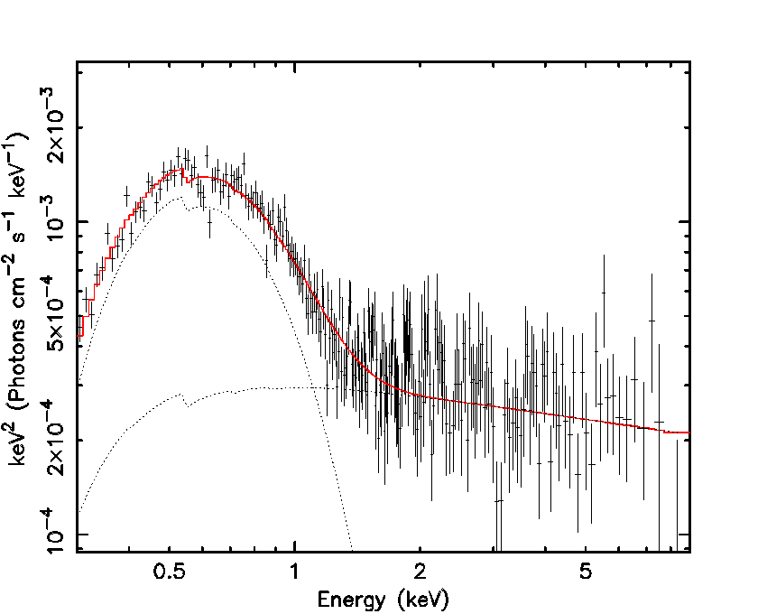

# IRAS 13224-3809
The observations and analysis covered in this repository were carried out as part of my thesis project at the University of Trento, under the supervision of Dr. Braito and Professor Perego.\
\
IRAS 13224-3809 is a highly variable Seyfert 1 galaxy, which has interesting features, especially in the X-ray spectra, which may possibly lead to the observation of winds.\
\
The aim of this work is to collect and select different groups of observations, coming from the [Swift-XRT satellite ](https://www.swift.ac.uk/user_objects/). The next step is to build the spectra relative to the selected observations, using the [NASA Heasoft Software and Xspec, an X-Ray Spectral Fitting Package](https://heasarc.gsfc.nasa.gov/docs/software/lheasoft/download.html),  and fit the spectra with some simple models.
\
\
In order to process the necessary data to constuct the spectra I downloaded Xspec: the software above mentioned, more specifically I only selected the packages relatived to the spectific mission, i.e. Swift.

## Spectra
Once NASA Heasoft software is installed we might run xspec. 
### Mac issues
Some Mac users might not be able to connect to the X server, meaning that it is not possible to interact with pop-up images using X11.
The issue was:\
I overcame this issue by running 'commands.txt' setting the display environment.
## Acknowledgements
- [V. Braito](https://www.researchgate.net/scientific-contributions/Valentina-Braito-2006816678) 
- [A. Perego](http://www.albinoperego.eu)
- [Marta Piscitelli](https://github.com/martapisci/martapisci)

## License
The code in this repo is released under version 3 of the [GNU General Public License](https://www.gnu.org/licenses/gpl-3.0.html).

